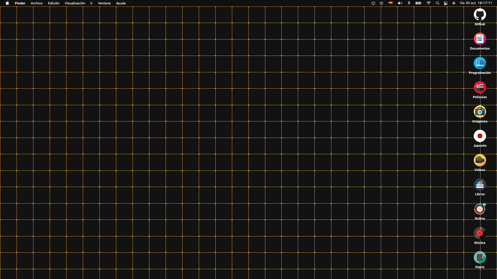

# WPapp

WPapp is a straightforward animated wallpaper application built using Electron.js. This application allows you to set animated wallpapers on your desktop effortlessly. Follow the steps below to get started.

## Default background



## Example animated background


## Usage

To use WPapp, follow these steps:

1. **Clone the Repository**: Begin by cloning the WPapp repository to your local machine. You can do this by running the following command in your terminal:

    ```shell
    git clone https://github.com/your-username/WPapp.git
    ```

2. **Navigate to the Project Directory**: Use the `cd` command to enter the project directory:

    ```shell
    cd WPapp
    ```

3. **Install Necessary Dependencies**: Before you can run WPapp, you need to install the required npm modules. Run the following command to do so:

    ```shell
    npm install
    ```

    This command will read the `package.json` file and install all the necessary dependencies, including Electron.js and Electron Store.

4. **Install Electron Builder**: Electron Builder is a tool to package Electron apps for distribution. You can install it globally using npm:

    ```shell
    npm install -g electron-builder
    ```

5. **Build the Application**: To build the application, use the following command:

    ```shell
    npm run build
    ```

    This command will package the application and create an installer for your platform (e.g., .exe for Windows, .dmg for macOS, or .AppImage for Linux) in the `dist` directory.

6. **Install WPapp**: After the build is complete, locate the installer in the `dist` directory and install WPapp on your computer.

7. **Launch WPapp**: Once installed, you can launch WPapp from your desktop or applications menu.

8. **Set Animated Wallpaper**: Open WPapp, and use its user-friendly interface to select and set your preferred animated wallpaper.

9. **Enjoy Your Animated Wallpaper**: Sit back and enjoy your new animated desktop wallpaper!

Now you have successfully set up and used WPapp to have animated wallpapers on your desktop.

## Repository Contents

The WPapp repository contains the following important files and directories:

- `src`: This directory contains the source code of the WPapp application.
- `package-lock.json` and `package.json`: These files define the project's dependencies and settings.
- `preload.js`: This JavaScript file provides a script that can be executed in the Electron renderer process.
- `main.js`: This is the main entry point of the Electron application.

Please make sure not to modify or delete any essential files or directories in the repository.

## Additional Notes

- **Node Modules**: You should notice that a `node_modules` directory is not included in the repository. This is because it contains all the project's dependencies and can be easily generated by running the `npm install` command as described above.

- **Electron and Electron-Store**: These packages are included as dependencies in the `package.json` file and will be automatically installed when you run `npm install`.

- **Electron Builder**: This tool is used to package the Electron app into an installer for your platform. Make sure you have it installed globally using `npm install -g electron-builder` as mentioned above.

- **Customization**: If you want to customize the WPapp application or add additional features, you can explore the `src` directory, where you'll find the source code of the application.

Now that you have successfully set up WPapp, you can enjoy dynamic and animated wallpapers on your desktop. Feel free to explore and modify the application to suit your preferences and needs.
